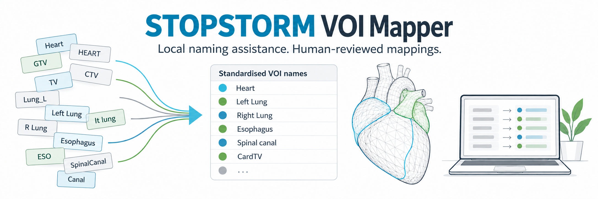
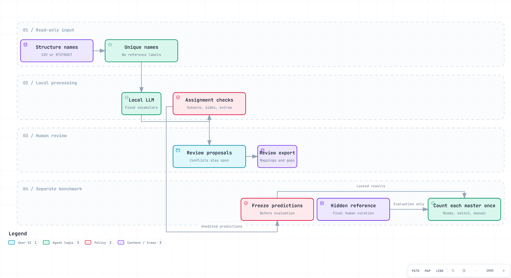

# STOPSTORM VOI Mapper

Local name-matching assistance for radiotherapy research. The tool proposes mappings to a 40-VOI vocabulary, checks laterality and duplicate assignments, and leaves uncertain or conflicting structures open for review. It never modifies DICOM objects or approves a clinical plan.

## Quick start

Python 3.10 or later is sufficient for the CSV workflow. Clone this repository and run from its root:

```bash
python -m unittest discover -s tests -v
python -m voi_mapper --input examples/synthetic_structures.csv --output results/exact_demo
```

The default uses normalized exact names and explicit terminology/safety rules, with no model calls. The synthetic example deliberately includes names that require a language model or manual review.

For local LLM proposals, start Ollama and select a model you have already installed:

```bash
python -m voi_mapper --input structures.csv --output results/local_review --mode llm --model YOUR_LOCAL_MODEL_TAG
```

No model is downloaded automatically. Only loopback HTTP endpoints are accepted. The tested study configuration uses a locally registered `qwen3.8-ridge-benchmark:3.7bpw` tag. This is a local alias, not a promise that an identically named model is available in the Ollama registry. Model metadata and its digest are recorded with each run. Model weights and their separate licences are not part of this repository. Other Ollama models need their own schema/quality check; quality is not transferable from a model name alone.

## Input and review

CSV headers:

```csv
Case,ROI_ID,StructureName,Volume_cc,SourceGroup
DEMO_A,1,Heart,500,Synthetic
DEMO_A,2,Lung Left,1600,Synthetic
```

`Case`, `ROI_ID` and `StructureName` are required. Case/ROI pairs must be unique. Volume is optional: a recorded zero prevents automatic assignment; a missing volume is not treated as zero. Volume does not prove anatomy or geometric equivalence. `SourceGroup` is optional provenance, for example a submission round. Only unique structure names enter the local model prompt; case IDs, volumes, source groups and reference assignments do not.

For a case folder containing exactly one RTSTRUCT:

```bash
pip install pydicom
python -m voi_mapper.extract path/to/case structures.csv --case DEMO_A
```

The extractor handles extensionless DICOM files. Multiple RTSTRUCTs require explicit selection by preparing a folder with the intended structure set. It does not export PatientName or PatientID and does not calculate volumes. ROI names can still contain identifying text, so inspect input before any sharing.

Outputs:

| File | Purpose |
|---|---|
| `mappings.csv` | Original name, volume, source group, model proposal, automatic assignment and editable review/comment columns |
| `missing_masters.csv` | Every master without an automatic assignment, per case |
| `extras.csv` | Extra structures outside the fixed master vocabulary, without inferring an unspecified subtype |
| `review.html` | Local searchable review table, with unresolved mappings highlighted |
| `run.json` | Input/prompt hashes, model metadata, parameters and counts |
| `cache/` | Local model responses for traceability; potentially sensitive, never commit |

A populated output directory is never overwritten. CSV files can be opened in Excel. The study's separate Excel preparation adds case-sheet ordering, master-name grouping and a missing-master view; this repository keeps its dependency-free export simple and does not claim to implement the complete historical workbook formatter.

## Workflow



[Download the interactive workflow](docs/workflow.html). The diagram is generated from [workflow.json](docs/workflow.json) with Archify. The banner is an AI-generated conceptual illustration, not patient anatomy or a result figure.

1. Read source names and deduplicate identical strings.
2. Ask the local model for one vocabulary proposal and an ordinal certainty judgment per name.
3. Check laterality, explicit contour subsets, device leads and recorded zero volumes. Apply the documented RIVA-to-LAD terminology rule. Keep unspecified vena cava as a gray extra, not as superior or inferior.
4. Enforce one structure per master per case. A sole exact-name candidate wins a conflict; otherwise conflicting candidates remain unassigned.
5. Review all proposals and open items. Numbered targets, contour subsets and boolean unions require anatomical review or a separate geometrical workflow.

The certainty categories are not calibrated probabilities. No duplicate automatic masters is a software invariant, not evidence that the retained mapping is correct. An incorrect unique mapping remains possible.

Version 0.2.0 expands the earlier single-digit component check to forms such as `PTV_10`, `PTV_01`, `CardTV_1` and `PTV1.1`. These names remain for human review rather than being interpreted automatically as a whole target. Naming patterns cannot establish completeness; review all target definitions. The previous implementation and replay remain frozen in the study record and in repository history.

Version 0.2.1 also rejects plural device-lead labels such as `ICD_leads` as generator contours. This closes a naming-pattern gap; it does not replace anatomical review.

## Evaluation and manuscript

The current study evaluation is a **retrospective reference-withheld replay**, not a prospective or externally validated clinical system. A frozen prompt, model digest, vocabulary, parameters, input list and reference hash are recorded before inference. Prior aliases and finalized mappings are not supplied to the model. Predictions are frozen before scoring against the final curation.

For the 30 September 2026 replay, assignment checks were amended after a code audit while inference was running, then frozen before the recorded reference comparison. This chronology is documented and is not preregistration of the full scoring implementation. The evaluator and clinical reference remain in the controlled study workspace.

In a retrospective multilingual research dataset, the reviewed workflow prepared **more than 75% of the eligible native case/master assignments** in agreement with the final human-reviewed mapping. This is within-dataset development evidence after review-driven rule corrections, not external validation or a measurement of historical editing effort. All proposed mappings still require human review. Clinical data, case identifiers, response caches and fixed study-result tables are not distributed here.

For an actionable evaluation, count each needed case/master once:

- **Ready:** the selected source structure matches the human-reviewed reference for that master.
- **Switch:** another source structure occupies the needed master, or the reference structure received another master.
- **Manual:** the needed master and its reference structure remain unassigned; candidate suggestions may still exist.
- **Extras:** proposals for masters absent from the reference are reported separately, never counted as additional successful matches. An extra `x` row occupying a needed master is one switch, not another match.

Keep the original frozen replay separate from post-review development results. Report assignment-level and whole-case completeness separately. A case with every required slot ready can still have surplus proposals requiring rejection; this does not mean an entirely review-free case.

On a shared GPU, route model traffic through your installed local coordinator using `--endpoint http://127.0.0.1:11436`, rather than bypassing its queue. Queue installation, durable submission, ownership and script/chat attribution are site-specific responsibilities, not provided by this portable package. Do not embed queue tokens in CSV inputs or repository files. The standard standalone Ollama endpoint remains available for independently managed machines.

Do not report total-row accuracy dominated by unassigned structures as the principal result. Do not interpret a replay as historical time saved or the number of edits actually made during original curation. Final source names may already incorporate earlier repairs, and the curated reference can itself need review. The study-specific data and case-level results are deliberately not distributed here.

## Limits

This is name matching, not segmentation, dose calculation, DICOM repair or anatomical validation. It cannot establish contour completeness from a name. It does not infer target intent from dose. A shared name is cached across cases and therefore cannot resolve case-specific anatomy. The vocabulary groups historical GTV/CTV/TV labels under CardTV for this cardiac research use case, while ITV and PTV remain separate; do not reuse that target convention for tumour studies without changing the vocabulary and prompt.

## Development

```bash
python -m unittest discover -s tests -v
```

Tests cover duplicate prevention, independent cases, laterality, abstention, malformed input and loopback-only requests. Contributions should include synthetic examples and tests. Do not submit clinical DICOM files, patient-identifying labels, internal case lists or model-response caches in issues or pull requests.

Code: MIT licence. Third-party diagram runtime notices are in [THIRD_PARTY_NOTICES.md](THIRD_PARTY_NOTICES.md).
