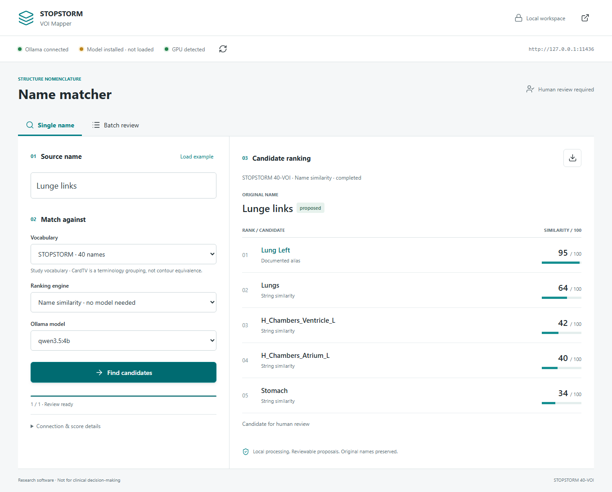
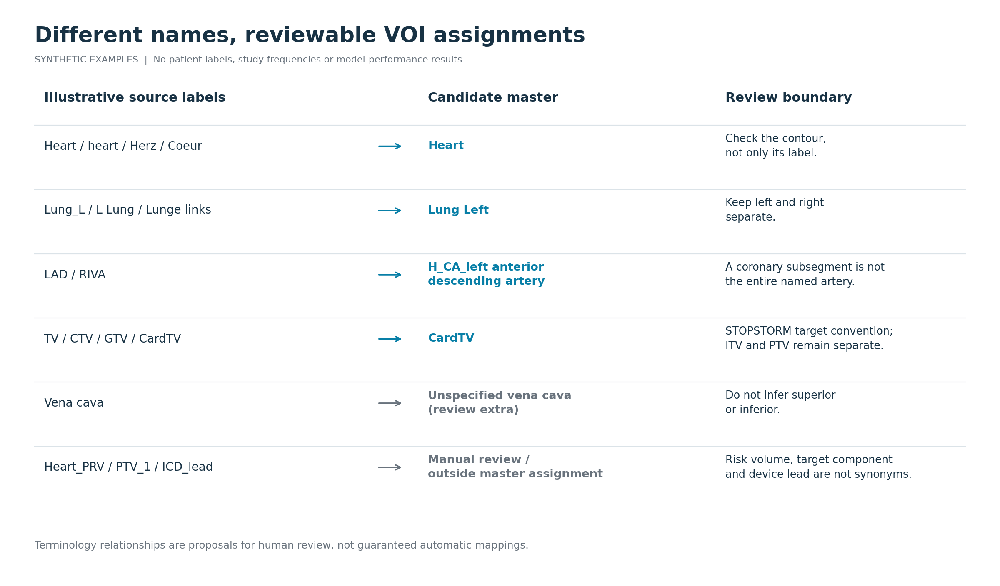

# STOPSTORM VOI Mapper

Local name-matching assistance for radiotherapy research. The tool proposes mappings to a 40-VOI vocabulary, checks laterality and duplicate assignments, and leaves uncertain or conflicting structures open for review. It never modifies DICOM objects or approves a clinical plan.

## Try the local GUI

Enter a name, choose **STOPSTORM** or **AAPM TG-263**, and inspect ranked candidates
with explicit score meanings. Use single-name lookup or case-aware batch review
with CSV import/export. Live indicators distinguish Ollama connectivity, installed
and loaded models, and observed GPU availability/use.



From the cloned repository, in your Python environment:

```bash
python -m pip install -e ".[gui]"
voi-mapper-gui --install-tg263
```

This opens a **local** browser app. The TG-263 setup explicitly imports the pinned
official worksheet; no model is downloaded. Name similarity works immediately
without a GPU. Select **Local LLM** to use an installed Ollama model.

**[Setup, Ollama connection, batch workflow and score interpretation](docs/gui.md)**

The GUI is an exploratory software extension, separate from the original
evaluated CLI workflow. Scores are not calibrated probabilities; proposals
still require human review. No study results are disclosed by the screenshots.

## From heterogeneous names to a reviewable dataset

Developed alongside the curation of STOPSTORM radiotherapy DICOM data, this workflow addresses a practical problem: the same volume of interest (VOI) can arrive with different spellings, abbreviations and languages, while similar names can describe different structures.



*Illustrative examples, not patient labels or study results. Arrows show possible terminology relationships for review, not guaranteed automatic assignments. [Vector figure](docs/naming-variation.svg) and [complete 40-VOI catalogue](docs/vocabulary.md).*

The practical benefits are a consistent vocabulary for downstream analysis, pre-filled proposals for reviewers, explicit duplicate and laterality checks, and separate lists of missing or unresolved structures. Original names remain visible beside the proposed master names. These features make heterogeneous submissions easier to inspect and organise; they do not establish contour accuracy or a measured reduction in working time.

This repository is a shareable methods and software companion. It does not report unpublished cohort counts, mapping success rates, dosimetric findings or model-comparison results from the manuscript.

## Quick start

Python 3.10 or later is sufficient for the CSV workflow. Clone this repository and run from its root:

```bash
python -m unittest discover -s tests -v
python -m voi_mapper --input examples/synthetic_structures.csv --output results/exact_demo
```

The default uses normalized exact names and explicit terminology/safety rules, with no model calls. The synthetic example deliberately includes names that require a language model or manual review.

For local LLM proposals, start Ollama and select a model you have already installed:

```bash
python -m voi_mapper --input structures.csv --output results/local_review --mode llm --model YOUR_LOCAL_MODEL_TAG
```

No model is downloaded automatically. Only loopback HTTP endpoints are accepted. The reproducible research configuration uses a **Qwen3.5-family model with 27.3B parameters and IQ2_M quantisation**, registered locally as `qwen3.8-ridge-benchmark:3.7bpw`. The alias does not describe the actual model family and is not a public model download identifier. [Configuration and reproducibility details](docs/evaluation.md) record the checkpoint digest and inference settings. Model weights and their separate licences are not part of this repository.

## Input and review

CSV headers:

```csv
Case,ROI_ID,StructureName,Volume_cc,SourceGroup
DEMO_A,1,Heart,500,Synthetic
DEMO_A,2,Lung Left,1600,Synthetic
```

`Case`, `ROI_ID` and `StructureName` are required. Case/ROI pairs must be unique. Volume is optional: a recorded zero prevents automatic assignment; a missing volume is not treated as zero. Volume does not prove anatomy or geometric equivalence. `SourceGroup` is optional provenance, for example a submission round. Only unique structure names enter the local model prompt; case IDs, volumes, source groups and reference assignments do not.

For a case folder containing exactly one RTSTRUCT:

```bash
pip install pydicom
python -m voi_mapper.extract path/to/case structures.csv --case DEMO_A
```

The extractor handles extensionless DICOM files. Multiple RTSTRUCTs require explicit selection by preparing a folder with the intended structure set. It does not export PatientName or PatientID and does not calculate volumes. ROI names can still contain identifying text, so inspect input before any sharing.

Outputs:

| File | Purpose |
|---|---|
| `mappings.csv` | Original name, volume, source group, model proposal, automatic assignment and editable review/comment columns |
| `missing_masters.csv` | Every master without an automatic assignment, per case |
| `extras.csv` | Extra structures outside the fixed master vocabulary, without inferring an unspecified subtype |
| `review.html` | Local searchable review table, with unresolved mappings highlighted |
| `run.json` | Input/prompt hashes, model metadata, parameters and counts |
| `cache/` | Local model responses for traceability; potentially sensitive, never commit |

A populated output directory is never overwritten. CSV files can be opened in Excel. The study's separate Excel preparation adds case-sheet ordering, master-name grouping and a missing-master view; this repository keeps its dependency-free export simple and does not claim to implement the complete historical workbook formatter.

## Workflow


[Download the interactive workflow](docs/workflow.html). The diagram is generated from [workflow.json](docs/workflow.json) with Archify. The banner is an AI-generated conceptual illustration, not patient anatomy or a result figure.

1. Read source names and deduplicate identical strings.
2. Ask the local model for one vocabulary proposal and an ordinal certainty judgment per name.
3. Check laterality, explicit contour subsets, device leads and recorded zero volumes. Apply the documented RIVA-to-LAD terminology rule. Keep unspecified vena cava as a gray extra, not as superior or inferior.
4. Enforce one structure per master per case. A sole exact-name candidate wins a conflict; otherwise conflicting candidates remain unassigned.
5. Review all proposals and open items. Numbered targets, contour subsets and boolean unions require anatomical review or a separate geometrical workflow.

The certainty categories are not calibrated probabilities. No duplicate automatic masters is a software invariant, not evidence that the retained mapping is correct. An incorrect unique mapping remains possible.

Version 0.2.0 expands the earlier single-digit component check to forms such as `PTV_10`, `PTV_01`, `CardTV_1` and `PTV1.1`. These names remain for human review rather than being interpreted automatically as a whole target. Naming patterns cannot establish completeness; review all target definitions. The previous implementation and replay remain frozen in the study record and in repository history.

Version 0.2.1 also rejects plural device-lead labels such as `ICD_leads` as generator contours. This closes a naming-pattern gap; it does not replace anatomical review.

## Research use and further development

The aim was to make multicentre radiotherapy data manageable for analysis, rather than to optimise or compare language models. Qwen provides the documented local configuration. Other local or contemporary cloud models, with or without task-specific tuning, may improve mapping performance; this is a direction for further work, not a result claimed here. The open-source implementation provides a basis for evaluating these extensions and adapting the workflow to other use cases.

The distributed CLI supports **local Ollama only**. A cloud adapter would be a separate extension, not an existing feature. Even structure names can contain patient identifiers: screen them and follow institutional data-protection requirements before considering external processing. Do not upload DICOM, case identifiers, reference labels or response caches with a cloud request.

For other applications, revise the vocabulary and prompt together, use independent reference annotations, and test the same assignment checks. See [evaluation and reproducibility](docs/evaluation.md) for an assignment-level assessment framework. Published code and synthetic examples support inspection and reuse; study-specific data and results remain in the controlled research workspace.

On a shared GPU, route model traffic through your installed local coordinator using `--endpoint http://127.0.0.1:11436`, rather than bypassing its queue. Queue installation, durable submission, ownership and script/chat attribution are site-specific responsibilities, not provided by this portable package. Do not embed queue tokens in CSV inputs or repository files. The standard standalone Ollama endpoint remains available for independently managed machines.

## Referencing this software

Use GitHub's **Cite this repository** entry or [CITATION.cff](CITATION.cff), and record the version and commit used for an analysis. Version 0.3.0 adds the exploratory GUI without changing the original CLI mapping core, prompt or 40-name vocabulary. The CLI receipt now records the installed package version. For the evaluated research configuration, use the frozen commit documented in [evaluation.md](docs/evaluation.md), not the GUI ranker. A manuscript citation can be added once the associated article has a public bibliographic record. No article DOI or publication status is implied here.

## Limits

This is name matching, not segmentation, dose calculation, DICOM repair or anatomical validation. It cannot establish contour completeness from a name. It does not infer target intent from dose. A shared name is cached across cases and therefore cannot resolve case-specific anatomy. The vocabulary groups historical GTV/CTV/TV labels under CardTV for this cardiac research use case, while ITV and PTV remain separate; do not reuse that target convention for tumour studies without changing the vocabulary and prompt.

## Development

```bash
python -m unittest discover -s tests -v
```

Tests cover duplicate prevention, independent cases, laterality, abstention, malformed input and loopback-only requests. Contributions should include synthetic examples and tests. Do not submit clinical DICOM files, patient-identifying labels, internal case lists or model-response caches in issues or pull requests.

Code: MIT licence. Third-party diagram runtime notices are in [THIRD_PARTY_NOTICES.md](THIRD_PARTY_NOTICES.md).
