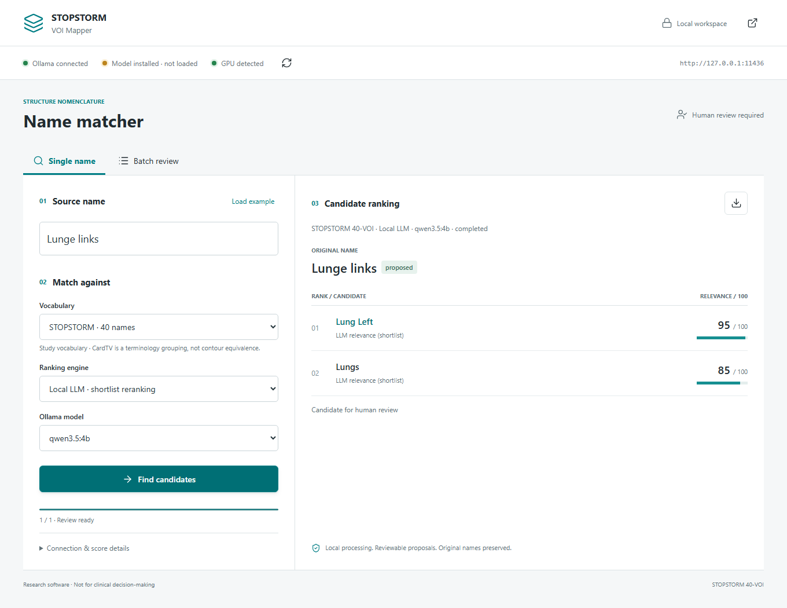
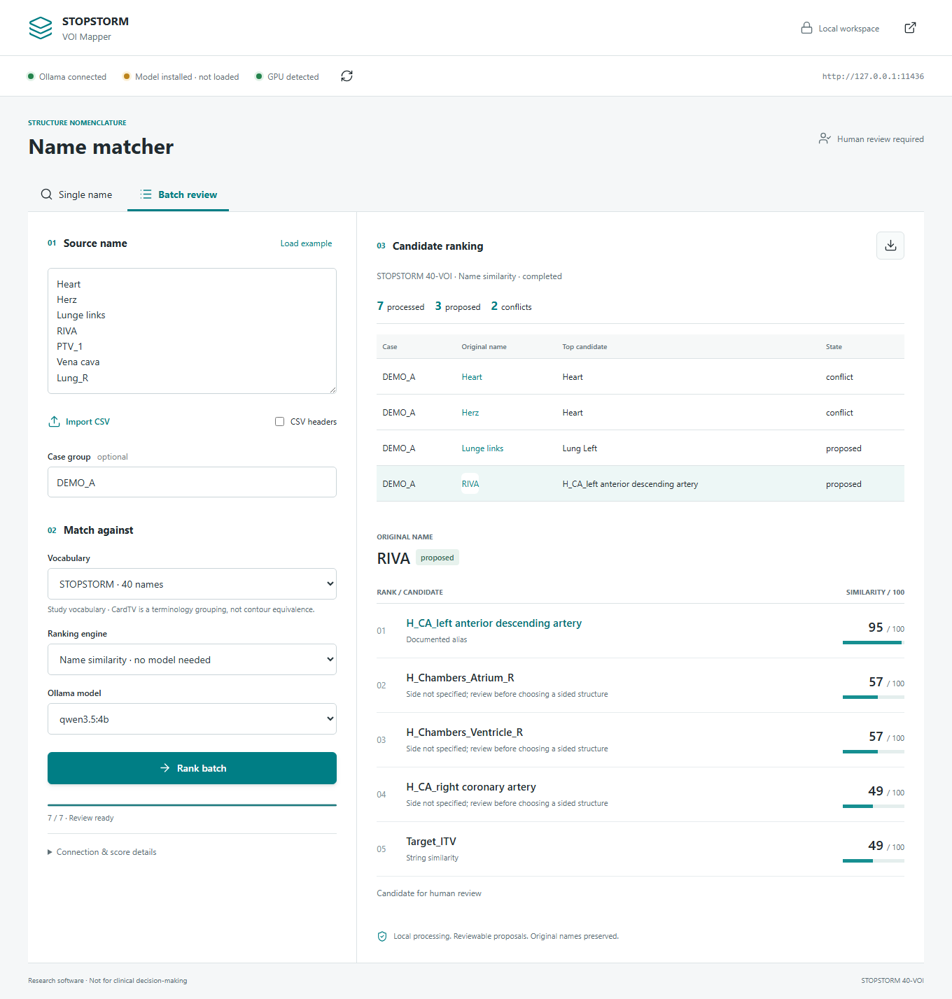

# Local GUI tester

An exploratory companion to the original CSV workflow: enter a name, compare
ranked candidates, or inspect a batch. It proposes names for human review and
never changes DICOM objects. The GUI's ranking scores and shortlist prompts are
new software features, not the evaluated configuration of the STOPSTORM study.


## Install and start

Python 3.10+ is required. From a terminal:

```bash
git clone https://github.com/Kiragroh/STOPSTORM-VOI-Mapper.git
cd STOPSTORM-VOI-Mapper
python -m venv .venv
```

Activate the environment on Windows with `.venv\Scripts\activate`, or on
macOS/Linux with `source .venv/bin/activate`, then:

```bash
python -m pip install -e ".[gui]"
voi-mapper-gui --install-tg263
```

The last command explicitly downloads the official TG-263 worksheet, checks its
checksum, imports 717 primary names and opens `http://127.0.0.1:8765`. Subsequent
starts need only `voi-mapper-gui`. If that port is occupied, use `--port 8876`.
The STOPSTORM vocabulary and name-similarity engine work without Ollama or a GPU.
For STOPSTORM only, `pip install -e .` and `python -m voi_mapper.gui` are enough.

The catalogue cache is `%LOCALAPPDATA%/stopstorm-voi-mapper/tg263.json` on Windows
and `~/.cache/stopstorm-voi-mapper/tg263.json` otherwise. `--catalogue PATH`
selects a previously imported catalogue. The import can also be run separately:

```bash
python -m voi_mapper.catalogue --source TG263_Nomenclature_Worksheet_20170815.xls
```

## Connect Ollama

1. Install [Ollama](https://ollama.com/download) and start the local service.
2. Choose a local text model compatible with Ollama structured JSON output. For
   example, explicitly download a [Qwen model](https://ollama.com/library/qwen3.5:4b) with `ollama pull qwen3.5:4b`.
   This is a small tester model, **not** the study checkpoint; see
   [the recorded research configuration](evaluation.md).
3. Check availability with `ollama list`. The application never downloads weights.
4. Start `voi-mapper-gui --endpoint http://127.0.0.1:11434`, choose **Local LLM**
   and an installed model. Enter a name and select **Find candidates**.

Only loopback HTTP endpoints are accepted. Remote Ollama servers and cloud model
entries are not supported. Entries reported as remote by Ollama or using cloud
tags are excluded. Direct Ollama connections also check `/api/show`; the shared
coordinator exposes `/api/tags` instead. Keep that locally administered backend
configured for local inference; this tool cannot police an arbitrary proxy.
CPU inference can work, but can be slow; the direct
Ollama request timeout is 180 seconds. Model memory requirements vary with model,
quantisation and context size. An installed model is not proof that it fits.

### Shared GPU coordinator

On a machine using the optional STR shared GPU coordinator, do not point directly
at its internal Ollama backend. Configure the local broker and its private token:

```powershell
voi-mapper-gui --endpoint http://127.0.0.1:11436 `
  --coordinator-token-file "$env:LOCALAPPDATA/STR/GPUCoordinator/control.token"
```

This adapter records the actual entry script, its hash, model and
`CODEX_THREAD_ID` when available. Requests use durable jobs; the GUI reports
queued/running/cancelling states. The token stays server-side and is not placed
in URLs or browser storage. The coordinator is a separate installed dependency,
not included here. Only this GUI's own request is cancelled. Other GPU jobs are
not killed, bypassed or unloaded. The coordinator may unload a model after each
request, so **installed, not loaded** after completion is normal.

## What the lights mean

| Indicator | Evidence |
|---|---|
| Ollama connected | The local model listing responds. |
| Model installed, not loaded (amber) | Selected model appears in `/api/tags`, but not `/api/ps`. It loads on demand. |
| Model loaded (green) | Selected model is reported by `/api/ps`. |
| GPU detected (green) | `nvidia-smi` reports an NVIDIA GPU; free/total memory is in the tooltip. This is hardware detection, not an admission guarantee. |
| Model on GPU (green) | Ollama reports positive `size_vram` for the selected loaded model. Partial GPU offload also satisfies this condition. |
| Model on CPU / GPU unverified (amber) | No positive VRAM observation. NVIDIA probing is unavailable on some supported AMD/Apple systems, so absence of this probe is not proof that there is no GPU. |

Status is sampled, not continuous (8-second cache, 15-second browser polling).
The [Ollama running-model API](https://docs.ollama.com/api/ps) describes the VRAM
metadata used for the loaded-model indicator. No inference is triggered by a
status refresh.

## Ranking and review

**Name similarity** is deterministic: 100 for a normalized exact primary name,
95 for a documented alias, otherwise `round(85 * SequenceMatcher.ratio())` using
the best primary name, alias or description. Whitespace, punctuation, case and
diacritics are normalized. This is string similarity, not anatomical certainty.

**Local LLM** first retrieves up to 40 names using the same deterministic ranker,
then asks the model to return at most five ranked candidates. It may abstain.
Documented aliases and source descriptions are supplied as terminology evidence.
STOPSTORM's complete 40-name vocabulary fits; TG-263 uses a shortlist, so a correct
name outside that shortlist cannot be returned. The displayed 0-100 score is
model-rated relevance, **not a calibrated probability**. Scores are not comparable
across models or between the similarity and LLM engines.



An unblocked top score of at least 90, with a gap of at least 5 to the second
candidate, receives the label **proposed**. This is a review-triage rule, not a
validated decision threshold or an accepted clinical mapping. Explicit opposite
sides, unspecified sides, partial/PRV contours and numbered targets can require
review regardless of score. STOPSTORM keeps unspecified vena cava as an extra
structure rather than inventing a subtype. Original names and all candidate
scores remain visible.

TV/CTV/GTV can be terminology candidates for the study-specific CardTV category.
This does not assert identical contours or redefine clinical target concepts.
The GUI is not a TG-263 target-name generator or a full compliance validator.

## Batch input and export

Paste one name per line, or import a UTF-8 CSV with `StructureName`. Optional
`Case` and `ROI_ID` columns preserve grouping and identifiers:

```csv
Case,ROI_ID,StructureName
DEMO_A,1,Heart
DEMO_A,2,Herz
DEMO_A,3,Lunge links
DEMO_B,1,Heart
```

Without a case group, each name is an independent lookup. With a group, competing
top proposals for the same canonical name are all held for review; the tool does
not silently choose a lower-ranked alternative. Case/ROI IDs must be unique when
provided. Limits: 500 rows, 256 characters per field, 500 KB input. Click a row to
inspect its candidate ranking. Repeated names are inferred once within a batch.



Export contains one row per candidate, with original identifiers, catalogue,
engine, model tag, score basis, proposal, review state and run state. Formula-like
CSV cells are escaped. Failed or cancelled batches retain their completed rows;
the run state identifies partial output. Direct Ollama cancellation waits for the
current HTTP inference request to return; the UI does not claim immediate GPU
release. Coordinator cancellation follows its recorded terminal state.

## Data and source boundaries

Inputs/results stay in server memory (up to 20 runs) until the server stops or old
runs are evicted. Reloading the page reconnects to the tab's run using a session
ID; actual names are not stored in browser storage. Only unique structure names
and vocabulary candidates enter model prompts; case/ROI IDs do not. Ollama and
the optional coordinator have their own logging/retention policies. A source name
itself can contain identifying information. Use synthetic inputs for screenshots
and never publish patient exports or coordinator credentials.

The server binds only to `127.0.0.1`, refuses foreign Host/Origin requests and
requires a per-process session token for writes. It is a single-user local tool,
not an authenticated multi-user service. Do not expose it through a tunnel/proxy.

TG-263 source: [AAPM nomenclature resources](https://www.aapm.org/pubs/reports/rpt_263_supplemental/),
worksheet **TG263 v20170815**, `TG263_Nomenclature_Worksheet_20170815.xls`.
SHA-256: `5ff0b9e2ebf578793f6fa8f59c2357b3feb61fdc0f87171e9103a0495d93d150`.
Source spelling/descriptions are preserved, not silently corrected. The worksheet
is not bundled or relicensed. AAPM does not endorse this application.

## Development checks

```bash
python -m unittest discover -s tests -v
# Optional browser tests, with the GUI and TG-263 catalogue already running:
npm install --no-save playwright
# Set VOI_GUI_URL if not using http://127.0.0.1:8876
node tests/browser.cjs
```

The browser test uses synthetic names, requires an idle GUI, and saves example
screenshots. It does not invoke model inference. Live inference is a separate
integration check, not evidence of clinical validation or cohort-level accuracy.
For an explicit synthetic live test, set `VOI_LIVE_MODEL` to an installed model
and run `node tests/live_gui.cjs`. This calls the configured local endpoint and
does not bypass a shared coordinator.
